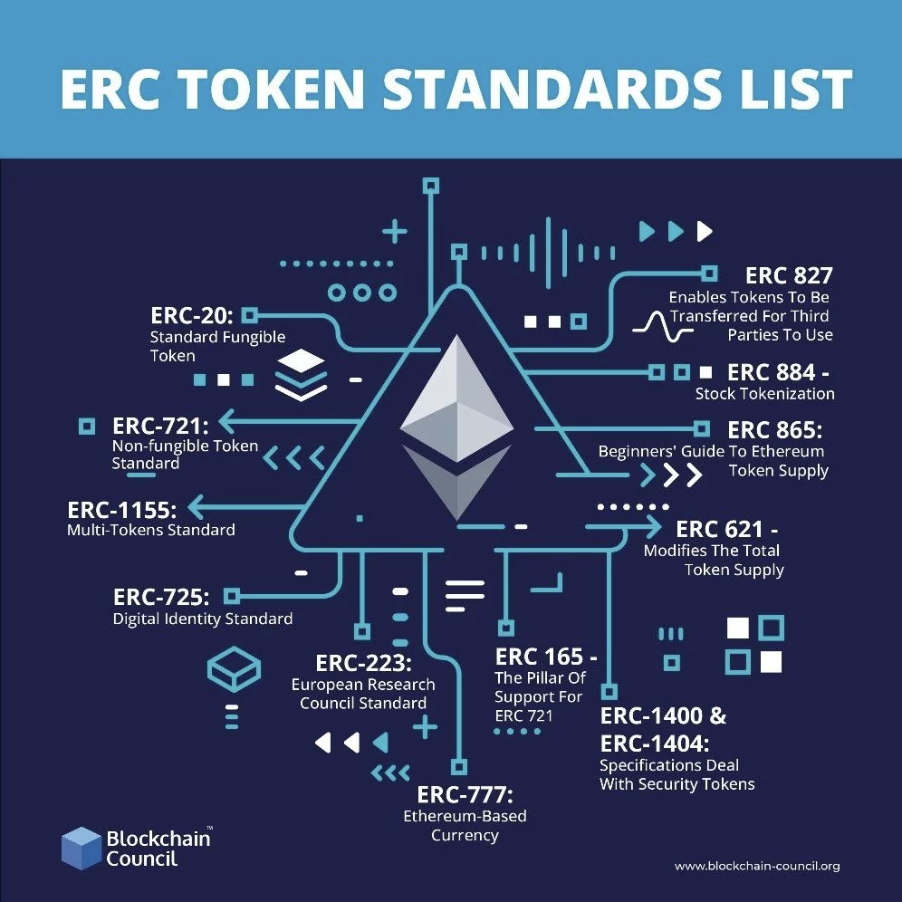

# BLOCKCHAIN # 

## Histoire de la blockchain ##
`présentation des diapos de Bernard BONCHE - cours électif de M1`

Problématiques : 
* authentification 
* certification 
* non falsification

Exemple de systeme 3 tiers (solution traditionnelle):   
un élève se connecte sur MyGes, authentification grâce à Google qui joue le rôle du tier de confiance. 

``Reseau Peer to peer : `` dans un réseau pair à pair, l'information est souvent décentralisée cad partout  la fois. Si un des noeuds tombe, il reste 99% de noeuds qui possèdent l'information.
Plus le nombre de noeuds augmente, plus la vitesse augmente car l'information est à plus d'endroits à la fois. (Emule,BitTorrent, PirateBay...) 

*Exemple de systeme décentralisé : Git* 

Principes : 
* partager l'information (données, base de données)
* validation de transaction (accord, traçage, immutabilité de la transaction)
* cryptographie (écrire, lire, modifier, supprimer selon les règles partagées et acceptées) : notions de clé privé (prouve la propriété en Blockchain) et publique  

### Instant culture générale ###
``Stuart Haber & Scott Stornetta (1991)`` : publication sur les premiers essais de la blockchain. Théorie d'un réseau décentralisé dans lequel les infos sont stockés dans des blocs (1 info/bloc)  
``Merkle Tree (1992)`` : permet de stocker plusieurs infos au sein d'un même bloc, optimise performances de la blockchain  
``Bitgold (2005)`` : décerner des titres de propriété dans la blockchain. Jeton qu'on pouvait dépenser deux fois (dépenser 1000€ sur son compte, et refaire la meme opération avant que le compte soit débité)``Double Spend`` Un jeton (token) = 1 élement avec un stock défini qu'on peut échanger de tier à tier dans un réseau décentralisé. Tous ces jetons sont identiques.  
``Bitcoin Whitepaper - Satoshi Nakamoto (2008)`` : préparer le code de la blockchain du bitcoin. Ce papier lance les fondements de la blockchain moderne.  
``Creation blockchain, prmeier déploiement Bitcoin(2009)``  

``Vitalik Buterin`` : Necessité de créer un langage adapté à la blockchain : création `` blockchain Etherium (2014)`` autour de laquelle on peut développer des application dApps (Decentralised Apps).  
3kM d'€ investis dans la blockchain

*NFT* : jeton unique, permet d'obtenir un certificat (ne peut pas servir de monnaie car unique). 

### Présentation de la blockchain ###

Un bloc = de l'information en liste chaînée.  
Un bloc : 
``  { id : 2 fois SHA256 (hexa)
    hash du bloc précédent (hexa)
    transaction : information } 
``  
La transaction a son propre hash. Elle est unique au sein d'un bloc. Plusieurs transaction dans un bloc.  

[Site etherscan](https://etherscan.io/) permet d'analyser les données du blockchain.

Dans un réseau décentralisé, un noeud doit contenir toutes les infos du réseau à un instant *t*. Un ``noeud léger`` contient une partie de l'information totale. La puissance de calcul est l'un des facteurs clé de la blockchain.  

Le processus de création de bloc = minage.   
``Mineur`` : personne qui alloue la puissance de calcul de sa carte graphique à la création d'un bloc.
Le but : calculer les hash des nouvelles transactions et des blocs.  
Problème : vérifier qu'à chaque nouveau bloc, tous les hash soient uniques à nouveau. En théorie, il y a un gap entre l'entrée de l'info dans la blockchain et la validation par les autres mineurs.

Les mineurs s'organisent en pool : un mineur mine un bloc, le pool est récompensé pour récompenser tous les mineurs. un pool plus puissant a plus de chances à offrir rémunération, mais cette rémunération sera divisée.  
## Solidity ##

[Docs Solidity](https://soliditylang.org/) 

Smart contract (DAPP) permet d'intégrer du code dans la blockchain.  
[Cryptozombies]( https://cryptozombies.io/fr/) : solidity est le langage pour déployer du code dans la blockchain.
Ce site permet de se faire les dents dessus, et de prendre les infos qui seront nécessaires pour monter notre propre projet.   
!! ATTENTION tout ce qui est déployé dans la blockchain est définitif !!

-- TODO: aller aussi loin que possible sur cryptozombies pour appréhender le langage Solidity -- 

Reseaux de tests : 
* test net : reseaux où les données ne sont pas conservées (tests de perf)
* dev net : déployer du code sans devoir payer de l'eth. On travaille sur ces reseaux. Ils peuvent être plus lents car ils n'auront pas le même nombre de noeuds.  

## Deploiement ##  
Les contrats dans Eth s'executent dans l'`` EVM `` (machine virtuelle ethereum) : l'EVM est totalement isolée du réseau.  

Adresse wallet = clé publique (consultation du wallet, solde d'eth), la clé privée permet de faire des actions sur le wallet. L'adresse du smartcontract est déterminée au moment du déploiement (vu sur etherscan au moment du déploiement test).  
Une `` transcation `` se fait d'un compte à un autre (``from``wallet ``to`` wallet, ``from`` wallet ``to`` contrat).  

Quand on déploie un smartcontract, Etherscan affiche le ByteCode du contrat. 
Il arrive qu'Etherscan demande à comparer avec le ByteCode (version compilée) du code source pour assurer la propriété du smartcontrat.  

## Exemples ##  

[https://github.com/Uniswap/v3-core](https://github.com/Uniswap/v3-core)  
Front qui accède à un smartcontract.  
Les transactions coûtent du ``gaz`` : quand on crée une transaction, il sera associé à la transac un qté de gaz. Ca permet de donner une estimation du coup d'execution et du coup de déploiement.
Si ce gaz est épuisé, la transaction ne passe pas. Le prix du gaz est fixé par le créateur de la transaction (Metamask met un coût par défaut).

[https://github.com/OpenZeppelin](https://github.com/OpenZeppelin) 
voir ERC20
permet de générer des smartcontract sécure  

  

# Exercices #

demo [remix](https://remix.ethereum.org/) IDE en ligne  
passer sur environnement "Injected Provider - Metamask"  
NB : Metamask piraté souvent, ne jamais laisser beaucoup d'eth sur le compte Metamask.

1) tenter de diminuer fortement le gaz sur du code léger et du code lourd pour observer les différences
2) qu'est ce qui se passe si on met trop de gaz ?
3) créer un smartcontact sur le sujet d notre choix

Parcourir des contrats OpenZepellin (en groupe):
4) observer le code des contrats => quels éléments/ mots clés sont visibles et qu'on a pas vu ( à quoi correspond le ``is`` ? comment on écrit une interface ? bonnes pratiques avec les _ dans les noms de variable? ``memory``? ``override``? ``balance of`` ? )
5) tester ce que vous avez observé avec Solidity!

pour travailler en local installer IDE [Truffle ou Ganache](https://trufflesuite.com/)
Si utilisé, faire une prez et comparer remix / truffle/ ganache

## Projet ##  

A rendre : smartcontract sur le sujet de notre choix (une adresse dans la blockchain avec un contrat) + documentation 